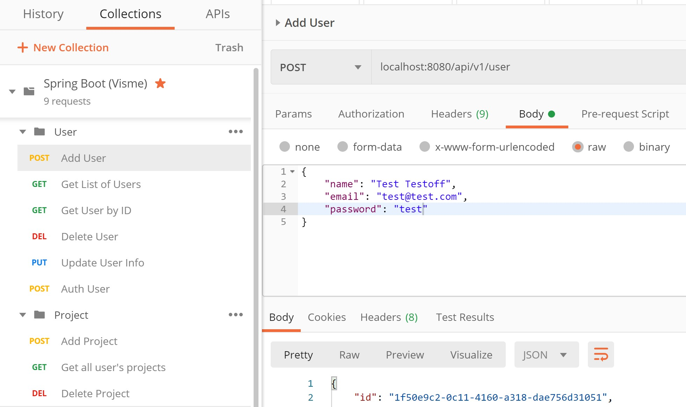
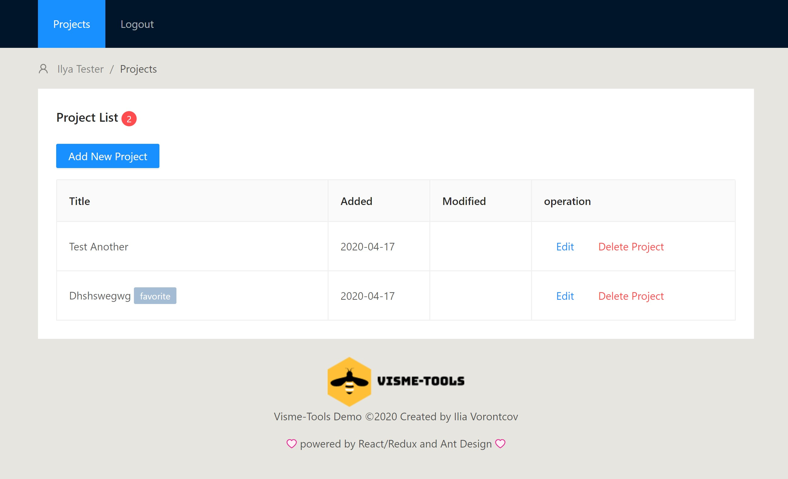

# visme-java
Test assignment for Visme.

## Server (API)
Srping Boot (Java) based. Runs as http://localhost:8080

You can also find [Postman](https://www.postman.com/)-ready test API calls and examples here: https://www.getpostman.com/collections/4939a400713479db3a70

## Client (React/Redux, Ant Design)
Located at this repo and can be found at: `src/main/demo-client`.

Install all npm dependencies from `demo-client` folder (run: `npm i`) and then run the client by next command: `npm start`.

Will be opened under your default web broswer. Otherwise proceed to http://localhost:3000 when it's running.

